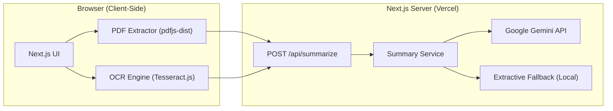

# SummifierAI — AI Document Summary Assistant

**Live Demo:** [https://summifier-ai.vercel.app](https://summifier-ai.vercel.app) — already deployed and running.

SummifierAI is a full-stack web application that accepts documents (PDF and image files), extracts text through native PDF parsing or client-side OCR, and generates intelligent, structured summaries using the Google Gemini API. The application is built with Next.js 16 (App Router), React 19, and TypeScript.

---

## Table of Contents

1. [Overview](#overview)
2. [Architecture](#architecture)
3. [Features](#features)
4. [Tech Stack](#tech-stack)
5. [Project Structure](#project-structure)
6. [How It Works](#how-it-works)
7. [API Reference](#api-reference)
8. [Environment Variables](#environment-variables)
9. [Getting Started](#getting-started)
10. [Security & Privacy](#security--privacy)
11. [Verification & Testing](#verification--testing)
12. [License](#license)

---

## Overview

SummifierAI processes documents through a two-tier pipeline designed for performance, cost efficiency, and privacy:

- **Client-Side Extraction:** PDFs and images are processed entirely in the browser. Native PDF parsing via `pdfjs-dist` preserves document structure without server uploads, while `Tesseract.js` Web Workers perform OCR for scanned documents and images.
- **Server-Side AI Synthesis:** Extracted text is sent to a Next.js API route, which calls the Google Gemini API with schema-constrained JSON output to produce an executive summary, key points, and document improvement suggestions.

If no API key is configured (or the Gemini call fails), the application transparently falls back to a local extractive summarizer, ensuring the product remains fully functional out of the box.

---

## Architecture

The following diagram illustrates the high-level system architecture, including the client-side extraction layer and the server-side summarization pipeline:



---

## Features

### Document Ingestion

- Drag-and-drop or file-picker upload supporting PDF, PNG, JPG, JPEG, WEBP, and TIFF formats.
- Client-side file validation with a 20 MB size limit and immediate error feedback.
- Dual-engine extraction:
  - **Native PDF Parsing:** Fast text extraction via `pdfjs-dist`, preserving line and paragraph structure.
  - **Client-Side OCR:** Automatic OCR fallback for scanned PDFs and direct OCR for images using `Tesseract.js` Web Workers (English language model).
- Live extraction progress reporting (parse stage, OCR stage, per-page progress).

### AI Summarization

- Powered by Google Gemini (`gemini-3.6-flash`) with a 1M-token context window.
- Three configurable summary lengths:
  - **Short:** 2–3 sentences, 3 key points, 2 improvement suggestions.
  - **Medium:** One paragraph (5–8 sentences), 4–5 key points, 3 suggestions.
  - **Long:** 3–4 detailed paragraphs, 6–7 key points, 4 suggestions.
- Schema-constrained JSON output (`responseSchema`) guaranteeing structured, parseable responses.
- Instruction constraints that force the model to use only document content, mirror the document language, and avoid inventing facts.
- Regeneration at a different length without re-uploading the document.

### Resilience

- Transparent fallback to a local extractive summarizer when no API key is present or the API call fails, with a clear notice explaining the mode.
- Built-in local summarization engine: stopword removal, term-frequency sentence scoring, positional lead-bias boosts, numeric-fact boosts, and fragment/run-on penalties.
- Heuristic-based improvement suggestions computed from document statistics (sentence length, paragraph density, presence of figures).

### User Experience

- Three-step wizard with step indicator (Upload → Extract → Summarize).
- Extracted-text preview with word count and reading-time estimate.
- Copy-to-clipboard support for summaries.
- Responsive, mobile-friendly interface with loading skeletons and shimmer effects.

---

## Tech Stack

| Component | Technology |
| :--- | :--- |
| Framework | Next.js 16 (App Router, React 19, TypeScript) |
| Styling | Tailwind CSS v4, Lucide React icons |
| PDF Extraction | `pdfjs-dist` (client-side Web Worker) |
| OCR Engine | `tesseract.js` v7 (client-side Web Worker) |
| AI Summarization | Google Generative AI SDK (`gemini-3.6-flash`) |
| Deployment | Vercel (serverless / edge ready) |

---

## Project Structure

```
.
├── public/
│   └── pdf.worker.min.mjs        # Vendored pdfjs-dist worker
├── src/
│   ├── app/
│   │   ├── api/
│   │   │   └── summarize/
│   │   │       └── route.ts      # Server-side summarization endpoint
│   │   ├── globals.css           # Tailwind entry point
│   │   ├── layout.tsx            # Root layout
│   │   └── page.tsx              # Main client-side workflow (state machine)
│   ├── components/
│   │   ├── header.tsx            # Application header
│   │   ├── footer.tsx            # Application footer
│   │   ├── step-indicator.tsx    # 3-step wizard progress indicator
│   │   ├── file-upload.tsx       # Drag-and-drop upload with validation
│   │   ├── extraction-progress.tsx  # Live progress UI (parse/OCR stages)
│   │   ├── extracted-text-preview.tsx # Text preview with word count
│   │   └── summary-display.tsx   # Results view with regenerate control
│   └── lib/
│       ├── pdf-extractor.ts      # Client-side PDF text extraction (pdfjs-dist)
│       ├── ocr-extractor.ts      # Tesseract.js OCR for images and scanned PDFs
│       ├── summarizer.ts         # Gemini + extractive fallback engines
│       └── utils.ts              # Shared helpers (formatting, validation)
├── .env.example                  # Environment template
├── next.config.ts                # Next.js + webpack + COOP/COEP headers
├── package.json
└── tsconfig.json
```

---

## How It Works

### 1. Text Extraction (Client-Side)

All document processing happens in the browser, so source documents never leave the client:

- **PDF with embedded text:** `pdfjs-dist` reads each page's text content and reconstructs line structure using the `hasEOL` markers emitted by the library.
- **Scanned PDF:** pages are rendered to an offscreen canvas at 2x scale and run through `Tesseract.js` OCR.
- **Images:** processed directly through the OCR pipeline.

If native PDF extraction yields fewer than 50 characters, the document is treated as scanned and OCR is triggered automatically.

### 2. Summarization (Server-Side)

The client submits the extracted text to `POST /api/summarize`:

1. The route validates the payload (non-empty text; length defaults to `medium`).
2. Text is truncated smartly at 100,000 characters at the nearest sentence boundary, with a truncation notice appended.
3. The summary service checks for a valid `GEMINI_API_KEY`. If absent, it delegates to the local extractive engine.
4. The Gemini model is invoked with a temperature of 0.3, a strict prompt (document-only facts, same-language output, exact counts for each section), and a JSON schema requiring `summary`, `keyPoints`, and `improvementSuggestions`.
5. The response is defensively parsed (JSON fences stripped) and returned to the client.
6. Any API failure is caught and replaced with the local extractive result, with the failure reason surfaced in the `notice` field.

### 3. Local Extractive Fallback Engine

The fallback is a deterministic, statistics-based summarizer:

- **Cleaning:** normalizes line endings, strips injected page markers, rejoins hyphenated line breaks, and collapses whitespace.
- **Tokenization:** lowercases and filters stopwords and tokens shorter than 3 characters.
- **Scoring:** each sentence is scored by normalized term frequency divided by a length-damping factor, then adjusted by:
  - Positional lead bias (1.35× first sentence, 1.2× second, 1.1× third).
  - Closing-sentence boost (1.05×) for conclusions.
  - Numeric-content boost (1.1×) for factual sentences.
  - Penalties for fragments (<5 words, 0.4×) and run-ons (>50 words, 0.8×).
- **Selection:** top-scoring sentences are restored to document order to produce a coherent summary; distinct top sentences become key points.
- **Suggestions:** readability heuristics generate actionable recommendations (sentence length, paragraph density, block length, figure usage).

---

## API Reference

### `POST /api/summarize`

Generates a structured summary from extracted text.

**Request Body:**

```json
{
  "text": "Full document text to summarize (string, required)",
  "length": "short | medium | long (optional, defaults to medium)"
}
```

**Success Response (200):**

```json
{
  "summary": "The generated summary text.",
  "keyPoints": ["Key point one.", "Key point two."],
  "improvementSuggestions": ["Suggestion one.", "Suggestion two."],
  "mode": "ai",
  "notice": "Optional explanatory note when running in fallback mode."
}
```

**Error Responses:**

| Status | Condition |
| :--- | :--- |
| 400 | `text` missing, not a string, or empty |
| 500 | Gemini API failure, invalid model response, or unexpected server error |

---

## Environment Variables

| Variable | Required | Description |
| :--- | :--- | :--- |
| `GEMINI_API_KEY` | No | Google AI Studio API key. When absent or invalid, the app runs in demo mode using the local extractive summarizer. |

Copy the template and add your key:

```bash
cp .env.example .env.local
```

```env
GEMINI_API_KEY=your_gemini_api_key_here
```

The key is consumed only inside the server-side API route and is never exposed to the browser. `.env*` files are excluded from version control via `.gitignore`.

---

## Getting Started

### Prerequisites

- Node.js 18+ (Node 20+ recommended)
- npm (or your preferred package manager)
- Optional: a free Google Gemini API key from [Google AI Studio](https://aistudio.google.com/)

### Installation

```bash
git clone https://github.com/asmitachakrab/AI-Document-Summarizer.git
cd AI-Document-Summarizer
npm install
```

### Configuration

```bash
cp .env.example .env.local
```

Add your Gemini API key to `.env.local`. If you skip this, the app runs in demo mode with the local extractive summarizer.

### Running Locally

```bash
npm run dev
```

Open [http://localhost:3000](http://localhost:3000) in your browser.

---

## Security & Privacy

- **API key protection:** `GEMINI_API_KEY` is read only inside the server-side route handler; it is never bundled into client code and never leaves the server.
- **Document privacy:** files are extracted entirely in the browser; only the extracted text is transmitted to the summarization endpoint.
- **No secrets in the repository:** environment files are gitignored; the repository contains only a placeholder template.
- **Safe parsing:** Gemini responses are schema-constrained and defensively parsed before being returned.
- **Worker isolation:** OCR and PDF parsing run in Web Workers, keeping the main thread responsive.

---

## Verification & Testing

Run the production build and type check to verify correctness:

```bash
# Type check
npx tsc --noEmit

# Production build
npm run build

# Lint
npm run lint
```

---

## License

MIT License. Created as part of the technical assessment for the Software Engineering position.

---

Asmita Chakraborty
<p align="left"> <a href="https://github.com/asmitachakrab">  </a> <a href="https://www.linkedin.com/in/asmita-chakraborty-4b19132a1/">  </a> 
